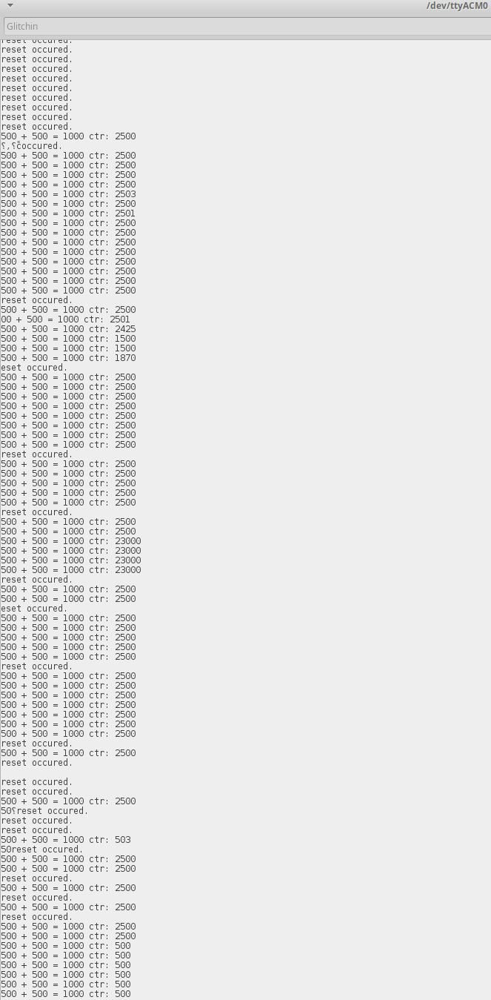
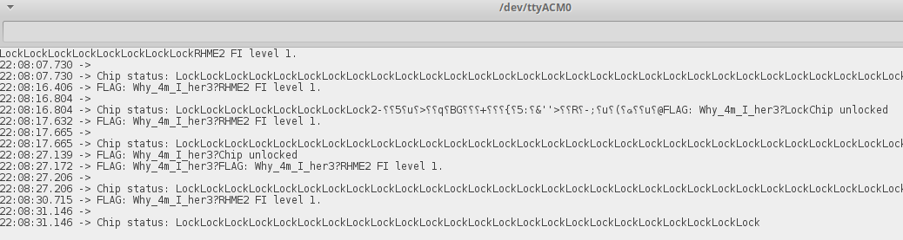
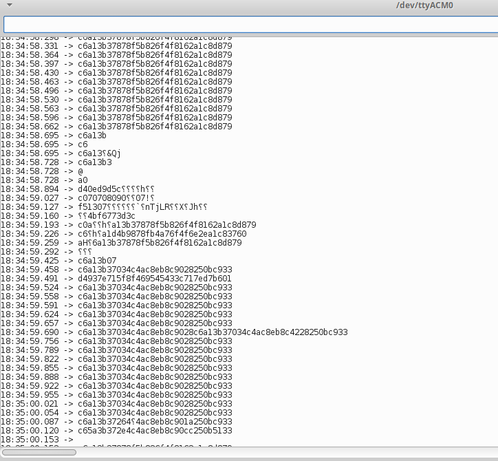
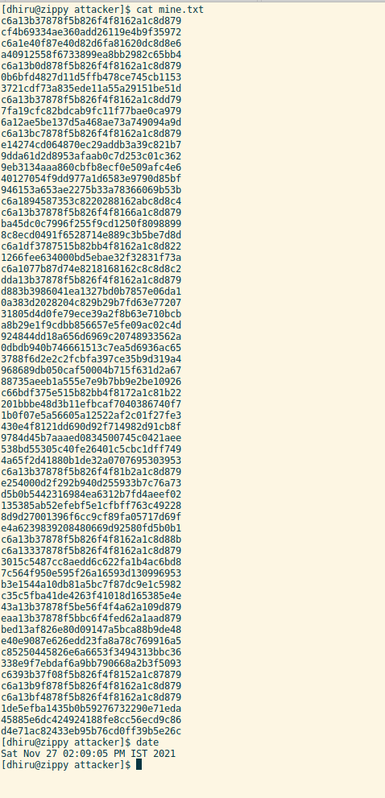
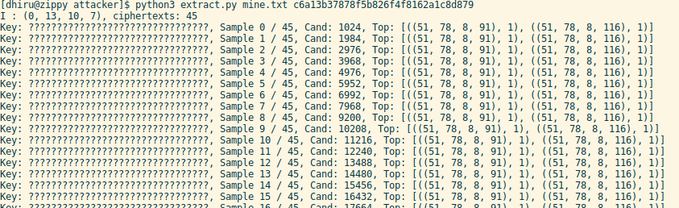
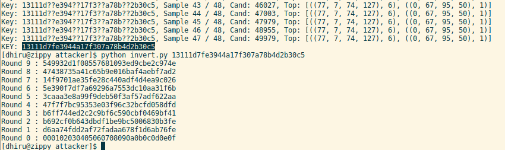

### AVR-Glitch-101

The most basic introduction to performing a power glitch attack.

Author: Dean Jerkovich (https://github.com/deanjerkovich)

Author 2: Dhiru Kholia (https://github.com/kholia)

#### Intro

The basic idea here is to set up some inexpensive hardware and watch what
happens when the power supply into the AVR (on the Arduino) is intentionally
interrupted. Some simple code that performs arithmetic is loaded on to the AVR
and it communicates back to the host computer over serial. The ground wire to
the AVR is running via a transistor which is switchable by an FPGA. The FPGA
has a simple piece of verilog which drops an output to 0 for a small number of
clock ticks every 20 million or so clock ticks (a bit over a second of time,
given the 12MHz clock). The net effect is that the AVR loses power for very
small factions of time, causing noticable disruptions in arithmetic and logic
without triggering the brown-out detection or causing a full reset.

#### Requirements

* An iCEstick / iCEBreaker / TinyFPGA BX FPGA board.

* An Arduino Uno target board (see [sparkfun](https://www.sparkfun.com/products/11021)) and [Arduino IDE](https://www.arduino.cc/en/main/software)

* Some connecting wires, 2N7000 MOSFET (TO-92 package for ease of use), 1k resistor (0.25W is fine)

  - FPGA's ground pin is connected to 2N7000's source (Pin 1)

  - FPGA's glitch output pin is connected to 2N7000's gate (Pin 2)

  - 2N7000's drain (Pin 3) is connected to the target's ground pin

  Note: 2N7000 and BS170 are non-RF MOSFETS but they are used widely in amateur
  RF applications (HF operations up to 30 MHz). They should be good enough for
  our low-current-usage purposes, especially the BS170.

  For higher-current applications, IRLZ44 should suffice.

* https://github.com/open-tool-forge/summon-fpga-tools - script to install open-source FPGA toolchains

#### Wiring it up

See the [blog post](https://flawed.net.nz/2017/01/29/avr-glitch-modifying-code-execution-paths-using-only-voltage/).

#### Results

Solving the `avr-glitch-101` challenge:

Solving the `Rhme2 challenge (2016) - Fiesta` challenge:

The `Differential Fault Injection Against AES` challenge:

w00t!

Note: We use our same `GND glitching` hardware setup for this `DFI attack`
against AES. This is different, and simpler from the upstream's approach.

#### References

- https://flawed.net.nz/2017/01/29/avr-glitch-modifying-code-execution-paths-using-only-voltage/

- https://blog.securitybits.io/2019/06/voltage-glitching-on-the-cheap/

- https://rot256.dev/post/glitch/

- https://github.com/kholia/aes-atmega328-glitching (fork)

- https://github.com/rot256/aes-atmega328-glitching (upstream)

- https://itooktheredpill.irgendwo.org/2020/stm8-readout-protection/

- https://blog.securitybits.io/2019/06/voltage-glitching-on-the-cheap/

- https://github.com/kholia/PicoGlitcher (fork)

- https://deralchemist.wordpress.com/2021/05/28/raspberry-pico-voltage-glitcher/
